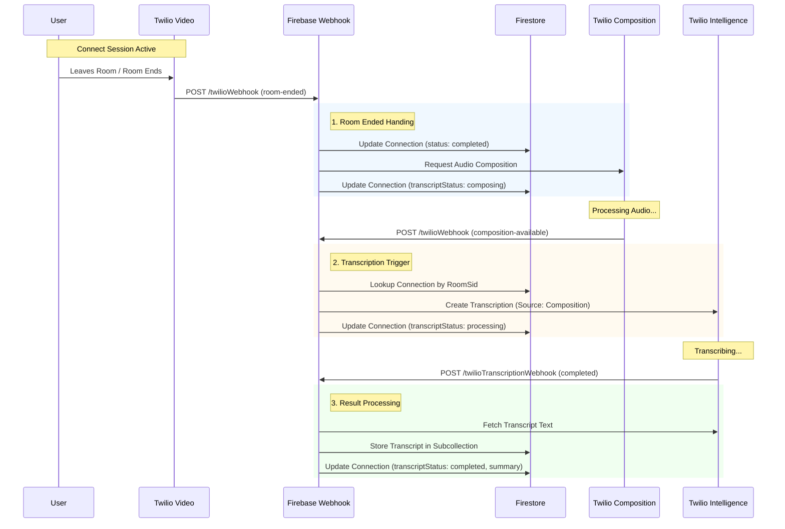

# System Workflows

This document outlines the core workflows of the Team Pulp application, detailing how users interact with the system and how backend processes automate connections and analysis.

## 1. User Onboarding & Team Setup

### Sign-Up
*   **Trigger**: User signs up via `/signup`.
*   **Action**: 
    *   Creates User record in Firestore.
    *   If first user, creates an **Account**.
    *   User creates a Profile (Name, Role, Timezone).

### Invite Flow
*   **Trigger**: Admin invites member via `/teams`.
*   **Action**: System sends email with `invite_id`.
*   **Outcome**: User clicks link -> Redirects to Sign-Up -> Automatically added to the correct Team/Account.

---

## 2. The Ritual (Scheduling Engine)

The "Ritual" is the automated process of pairing team members for connection sessions.

*   **Trigger**: 
    *   **Automated**: Cloud Scheduler runs every 30 minutes.
    *   **Manual**: Pub/Sub topic `check-schedules`.
*   **Process**:
    1.  **Query**: Finds `active` Schedules where `nextRunAt` <= `now`.
    2.  **Validate**: Checks if today matches the Schedule's `start_day`.
    3.  **Fetch & Pair**:
        *   Retrieves all team members.
        *   Shuffles members and creates pairs (Proposer & Confirmer).
        *   *Note: Current MVP uses random shuffle; future versions will optimize for unique connections.*
    4.  **Create Connection**:
        *   Creates a `connections` document with status `scheduling`.
        *   Assigns a `connectRoomUniqueName` (e.g., `connect-{id}`).
    5.  **Notify**: Sends "Connection Request" email to the Proposer with a link to schedule.
    6.  **Update Schedule**: advances `nextRunAt` by the frequency interval (e.g., 2 weeks).

---

## 3. Connect Session Lifecycle (Video to Analysis)

This workflow describes the stream of events from the moment a video call ends to the generation of AI-driven insights. It relies on a chain of webhooks and background processes.

### Sequence Diagram

### Event Stream Description

The following steps correspond to the backend processing flow immediately after a session:

1.  **Room Ended Event**
    *   **Source**: Twilio Video Webhook (`room-ended`).
    *   **Handler**: `functions/src/twilioWebhook.ts`
    *   **Logic**:
        *   Identifies the Connection ID from the Room Name.
        *   Updates Firestore Connection doc: sets `status` to `completed`, records `durationSeconds`.
        *   **Trigger**: Requests Twilio to create an **Audio Composition** from the room recordings.
        *   Updates Firestore: `transcriptStatus` = `composing`.

2.  **Composition Available Event**
    *   **Source**: Twilio Composition Webhook (`composition-available`).
    *   **Handler**: `functions/src/twilioWebhook.ts`
    *   **Logic**:
        *   Receives the `CompositionSid`.
        *   Finds the matching Connection in Firestore using `connectRoomSid`.
        *   **Trigger**: Requests Twilio Intelligence to create a **Transcription** using the new Composition as the source.
        *   Updates Firestore: `transcriptStatus` = `processing`.

3.  **Transcription Completed Event**
    *   **Source**: Twilio Intelligence Webhook.
    *   **Handler**: `functions/src/twilioTranscriptionWebhook.ts`
    *   **Logic**:
        *   Receives `TranscriptSid` with status `completed`.
        *   Fetches the full transcript text and sentences from Twilio.
        *   Stores the full transcript in `connections/{id}/transcripts/{id}`.
        *   Updates Firestore Connection doc: `transcriptStatus` = `completed` and creates a simple summary/preview.