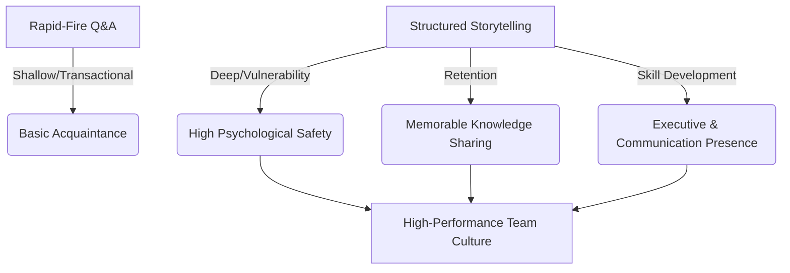

# TeamPulp: Fostering Connection Through the Art of Storytelling
*A Strategic Product Exploration for app06*

> [!NOTE]
> This document explores product directions, user experience shifts, and technical considerations for transforming TeamPulp from a fast-paced "Pardon the Interruption" (PTI) style icebreaker tool into a premium **storytelling and professional development platform**. It details how we can leverage our existing Next.js, Firestore, Twilio Video, and LLM-based architecture to make this pivot seamless and highly impactful.

---

## 1. Why Storytelling? The Strategic Shift

The historical direction of TeamPulp centered on **guided 15-minute interactions** to foster connectivity and generate relationship intelligence. While rapid-fire Q&A helps break the ice, the **art of storytelling** offers a much deeper, more transformative value proposition for both organizations and individuals.



### The Three Core Pillars of Value:
1. **Unlocking Deeper Relationships:** Stories trigger emotional resonance and neural coupling between speakers and listeners. Sharing personal narratives builds trust and empathy significantly faster than answering list-based questions.
2. **Developing the Individual (Communication Skills):** Storytelling is an essential business skill. By teaching and structure-coaching storytelling, TeamPulp shifts from a "nice-to-have bonding ritual" to an **employee growth & professional development platform** that budgets can easily justify.
3. **Fostering Organizational Memory:** Every company has valuable lessons locked in employee experiences. Elevating these into structured stories turns oral history into shared tribal knowledge, helping with onboarding, alignment, and breaking down functional silos.

---

## 2. Redesigning the Product Experience

To embed the art of storytelling without sacrificing the lightweight 15-minute nature of the product, we propose shifting from **4-5 quick-fire questions** to a **two-sided Storytelling Duet**.

### A. Pre-Session: Prompt Scaffolding (The "Story Seed")
*Currently, users join the call cold and see questions on the fly.*

**The Storytelling Nudge:**
When a connection is scheduled, both participants receive a **Story Seed** via email and Slack, prompting them to prepare mentally.
*   **Narrative Frameworks:** The system doesn't just ask a question; it provides a structural recipe.
    *   *The Pivot Spine:* "Think of a time when a project went completely wrong (Situation), how you scrambled to handle it (Struggle), and what you do differently now as a result (Shift)."
    *   *The Hero's Journey at Work:* "Recall a moment you felt completely out of your depth but overcame the challenge. Who was your mentor or supporter, and what did you discover about yourself?"

---

### B. In-Session: The "Story Room" Experience
*Currently, the UI shows a fast-moving timer (e.g., 3 minutes per question) with a synchronized transition.*

```text
+--------------------------------------------------------+
|  [Participant A Video]          [Participant B Video]  |
|  +---------------------+        +-------------------+  |
|  |                     |        |                   |  |
|  |                     |        |                   |  |
|  +---------------------+        +-------------------+  |
+--------------------------------------------------------+
|  STORYTELLER: Jane Doe                                 |
|  THEME: "The Pivotal Mistake"                          |
|                                                        |
|  [================== Active Story Arc ===============] |
|   0:00 - 1:30        1:30 - 4:30        4:30 - 6:00    |
|   [ Hook & Scene ]  [ The Obstacle ]  [ Resolution ]   |
|                                                        |
|  "Tell us about a time you made a critical error in    |
|   production. Paint the picture of that day."          |
|                                                        |
|  Listener Tip: "Pay attention to the turning point.   |
|                 What was the exact moment they knew?"  |
+--------------------------------------------------------+
```

**The Storytelling Nudge:**
*   **Fewer, Deeper Blocks:** The session is structured into exactly two **6-minute rounds** (Round 1: Person A tells, Person B listens; Round 2: Person B tells, Person A listens) with 3 minutes of wrap-up/reflection.
*   **The Story Arc Timer:** The timer is divided visually into storytelling checkpoints:
    1.  *0:00 - 1:30 (Set the Scene):* Who, where, and what was at stake?
    2.  *1:30 - 4:30 (The Climax & Conflict):* What went wrong, and what was the tension?
    3.  *4:30 - 6:00 (The Takeaway & Learning):* How did it change your perspective or behavior?
*   **Active Listening Prompts:** The listener's screen shows specific focal points to keep them engaged (e.g., *"Listen for what motivated the main action," "Think about how you would have reacted in their shoes"*).

---

### C. Post-Session: The "AI Story Coach" and "Story Bank"
*Currently, the LLM generates a basic summary, sentiment scores, and aggregates metrics.*

**The Storytelling Nudge:**
*   **Individual Coaching Insights:** Instead of just summarizing what was said, the AI analyzer reviews the *structure* of the stories and delivers constructive, private feedback to each individual on their storytelling style:
    *   *Pacing Analysis:* "Your delivery rate was about 135 words per minute—highly conversational and easy to follow."
    *   *Structural Check:* "You established the setup perfectly, but you rushed through the resolution. Next time, try spending 30 seconds more expanding on what you learned."
    *   *Vocabulary & Texture:* "You used excellent sensory words ('frantic,' 'silent') which made your anecdote highly engaging."
*   **The Company "Story Bank":**
    *   Post-session, the AI drafts a polished **3-sentence narrative synopsis** of the story told (e.g., *"How Sarah navigated a client crisis during her first week at Acme"*).
    *   With both users' consent, this synopsis (and optional audio clip) is published to a searchable company-wide **Story Bank**. 
    *   Teammates can browse, like, and comment on stories told across the company, magnifying connectivity from a 1:1 interaction into an organization-wide tapestry.

---

## 3. Practical Implementation Options

To integrate this within the current code constraints of TeamPulp, we can consider three distinct phases/options.

### Option 1: "Storytelling Themes" & Question Banks (Low Effort)
*No database schema or interface changes required. Purely a data-seeding approach.*

*   **How it works:** Modify the seeding script (`scripts/seed.ts`) to introduce storytelling-specific system themes.
*   **Theme Example:** *"The Crucible Moments"*
    *   *Question 1:* "Tell the story of the hardest technical bug you ever solved. What did it feel like when you finally found it?"
    *   *Question 2:* "Describe a time someone in your career went out of their way to help you. What was the impact, and how did it change your trajectory?"
*   **Pros:** Can be implemented in a day. Zero development risk.
*   **Cons:** Doesn't actively train storytelling skills or alter the fast-paced "PTI" feel.

---

### Option 2: The "Interactive Story Guide" UI (Medium Effort)
*Introduces narrative visual coaching elements to the video room UI and scheduling emails.*

*   **How it works:**
    1.  **Frontend Updates (`app/(dashboard)/connect/[connectionId]/page.tsx`):**
        *   Modify the video screen to show a two-round layout instead of a multi-question list.
        *   Add a step indicator corresponding to the story elements (Set the Scene $\rightarrow$ Challenge $\rightarrow$ Lesson).
        *   Add small, interactive "Speaker Prompt Cards" and "Listener Guide Cards" based on the active phase.
    2.  **Scheduling Customizations:**
        *   Add the prepared "Story Seed" text to the proposal and confirmation emails so participants can brainstorm ahead of time.
*   **Pros:** Significantly elevates the UX, making the session feel like a professional development exercise.
*   **Cons:** Requires UI changes in the complex video room component, though it doesn't break the underlying Twilio infrastructure.

---

### Option 3: The "AI Story Coach & Company Story Bank" (High Effort)
*A complete transformation of the post-session processing pipeline and the user dashboard.*

*   **How it works:**
    1.  **Firestore Schema Extension (`types/firestore.ts`):**
        *   Add a `storyBank` collection for sharing consented, AI-curated anecdotes.
        *   Update the `connections/{id}` document to hold private `storyCoachFeedback` for each participant.
    2.  **AI Pipeline Overhaul (`functions/src/twilioTranscriptionWebhook.ts`):**
        *   Update the LLM prompt to identify distinct story segments, rate the story's narrative flow (Hook, Tension, resolution), and construct highly actionable personal development feedback.
    3.  **Dashboard Extension:**
        *   Add a `/story-bank` feed page where employees can discover curated stories and learn about their colleagues' achievements and lessons.
*   **Pros:** Creates a massive competitive moat. Transforms the platform into a true strategic talent and culture tool.
*   **Cons:** Requires significant dev time, prompt engineering, and UI expansion.

---

## 4. Proposed Evolutionary Path

We recommend a **staged approach** to roll out storytelling, validating the value with users before heavily engineering the AI coaching components:

```mermaid
chronology
    title Storytelling Feature Rollout Plan
    section Phase 1: Theme Seeding
        Create Story Seeds: active
        Refactor Seeding Script: active
    section Phase 2: In-Call UX
        Update Room UI to Story Rounds: future
        Integrate Pre-Session Prompts: future
    section Phase 3: AI & Bank
        Develop AI Storytelling Coach: future
        Launch Company Story Bank: future
```

### Next Steps for Implementation:
1.  **Introduce Storytelling Templates:** Add a selection of "Narrative-driven" system themes in Firestore.
2.  **Adjust Call Structure Configuration:** Allow a schedule to specify `format: "storytelling" | "pti-qa"`. This gives admins the choice to toggle between pairing modes.
3.  **Add Storytelling Elements to the Video Screen:** Create custom prompts on the timer bar to guide the teller through their story phases.

---
*Document prepared for brad/app06 codebase review. Ready for feedback and next-step execution planning.*
